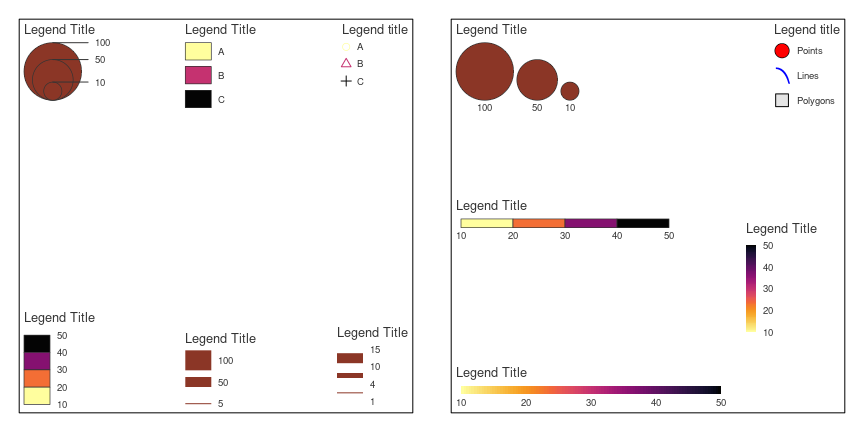
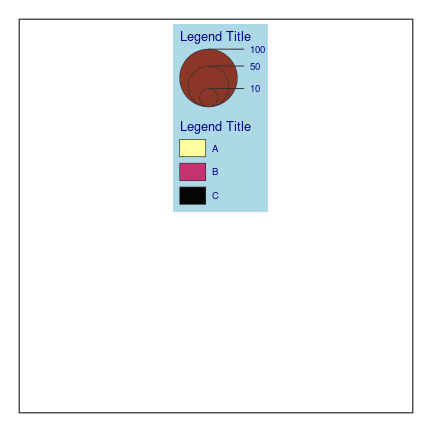

<!-- README.md is generated from README.Rmd. Please edit that file -->

# maplegend

<!-- badges: start -->

[](https://github.com/riatelab/maplegend/actions/workflows/R-CMD-check.yaml)
[](https://app.codecov.io/gh/riatelab/maplegend?branch=main)
[](https://www.repostatus.org/#active)
<!-- badges: end -->

Create legends for maps and other graphics. Thematic maps need to be
accompanied by legible legends to be fully comprehensible. This package
offers a wide range of legends useful for cartography, some of which may
also be useful for other types of graphics.

## Installation

You can install the released version of `maplegend` from CRAN with:

``` r
install.packages("maplegend")
```

Alternatively, you can install the development version of `maplegend`
from GitHub (**dev** branch) with:

``` r
remotes::install_github("riatelab/maplegend", ref = "dev")
```

## Example

The main function is `leg()`. Its `type` argument defines the legend
type.

``` r
library(maplegend)
opar <- par(mar = c(1, 1, 1, 1), mfrow = c(1, 2))
plot.new()
plot.window(xlim = c(0, 1), ylim = c(0, 1))
leg(type = "prop", val = c(10, 50, 100), pos = "topleft")
leg(type = "choro", val = c(10, 20, 30, 40, 50), pos = "bottomleft")
leg(type = "typo", val = c("A", "B", "C"), pos = "top")
leg(type = "symb", val = c("A", "B", "C"), pos = "topright")
set.seed(46)
leg(type = "histo", val = hist(rnorm(1000), breaks = 5, plot = FALSE))
leg(type = "prop_line", val = c(5, 50, 100), pos = "bottom", lwd = 20)
leg(type = "grad_line", val = c(1, 4, 10, 15), pos = "bottomright", lwd = c(1, 5, 10))
box()
plot.new()
plot.window(xlim = c(0, 100), ylim = c(-50, 50))
leg(type = "prop", val = c(10, 50, 100), pos = "topleft", horiz = TRUE)
leg(type = "cont", val = c(10, 20, 30, 40, 50), pos = "bottomleft", horiz = TRUE)
leg(type = "choro", val = c(10, 20, 30, 40, 50), pos = c(40, 10), horiz = TRUE)
leg(type = "cont", val = c(10, 20, 30, 40, 50), pos = "left")
leg(
  type = "symb", val = c("Points", "Lines", "Polygons"), pos = "topright",
  pch = list(21, "৲", 22), cex = c(2, 2, 2), border = c("black", "black"),
  pal = c("red", "blue", "grey90")
)
box()
par(opar)
```

<!-- -->

It is possible to create composed legends with `leg_comp()` and
`leg_draw()`.

``` r
opar <- par(mar = c(1, 1, 1, 1))
plot.new()
plot.window(xlim = c(0, 1), ylim = c(0, 1))
leg_comp(type = "prop", val = c(10, 50, 100)) |>
  leg_comp(type = "typo", val = c("A", "B", "C")) |>
  leg_draw(pos = "top", bg = "lightblue", fg = "darkblue", frame_border = NA)
box()
par(opar)
```

<!-- -->

## Background

This package is mainly intended for the construction of legends in the
[`mapsf`](https://riatelab.github.io/mapsf/) package. However, it can
also be used independently of `mapsf` with `base` plots or even with
[`igraph`
plots](https://gist.github.com/rCarto/da5a4b0cd982a8c85cb847506fd2f415).

## Community Guidelines

One can contribute to the package through [pull
requests](https://github.com/riatelab/maplegend/pulls) and report issues
or ask questions [here](https://github.com/riatelab/maplegend/issues).  
This project uses [conventional
commits](https://www.conventionalcommits.org/en/v1.0.0-beta.3/) and
[semantic versioning](https://semver.org/).
